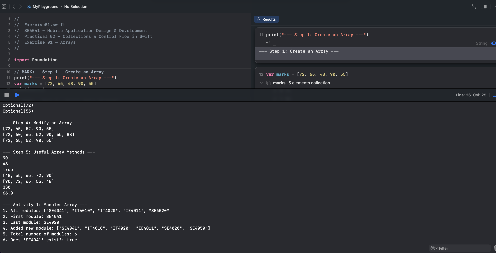
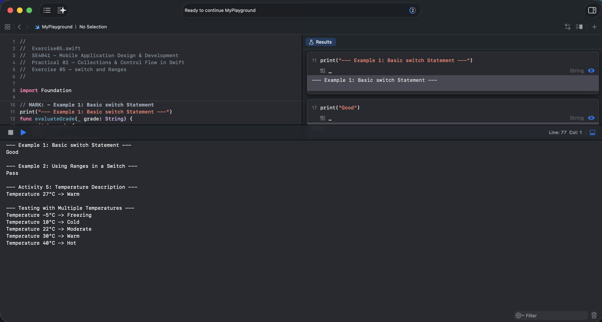
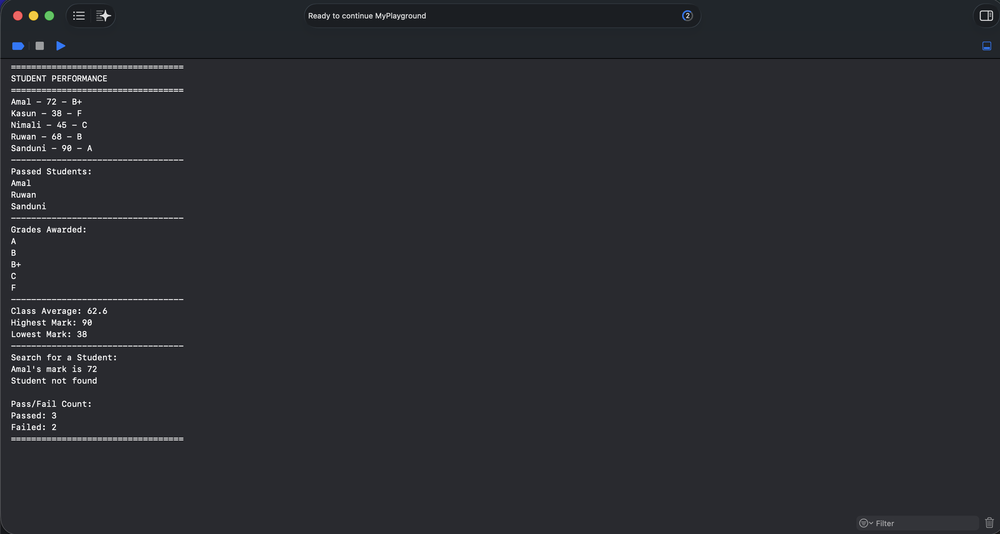

# SE4041: Mobile Application Design & Development
## Practical 02 – Collections & Control Flow in Swift

### Student Information
- **Student ID:** IT22100498
- **Student Name:** BANDARA M.R.J.K.
- **Degree:** BSc (Hons) in Information Technology / Interactive Media
- **Year / Semester:** Year 04 Semester 02 - 2026

---

## Practical Overview
This repository contains the completed exercises and activities for Practical 02, focusing on Swift collections and control flow constructs:
- **Collections:** Arrays, Sets, Dictionaries
- **Control Flow:** `if` / `else if` / `else`, `switch` statements with ranges (`...`, `..<`), loops (`for-in`, `while`, `repeat-while`), and loop control statements (`break`, `continue`).

---

## Repository Structure

```text
.
├── Exercise01.swift        # Arrays: Creation, modification, properties, and Activity 1
├── Exercise02.swift        # Sets: Uniqueness, set operations (union, intersection, etc.), Activity 2
├── Exercise03.swift        # Dictionaries: Key-value operations, optionals, Activity 3 (Phone Book)
├── Exercise04.swift        # If-Else Statements: Conditions and Activity 4 (Attendance)
├── Exercise05.swift        # Switch Statements & Ranges: Activity 5 (Temperature description)
├── Exercise06.swift        # Loops & Control Flow: for-in, while, repeat-while, break, continue, Activity 6
├── FinalChallenge.swift    # Final Practical Task: Student Performance Manager + Additional Challenge
└── screenshots/            # Output and execution verification screenshots
    ├── 01-Collections.png
    ├── 02-Control-Flow.png
    └── 03-Final-Challenge.png
```

---

## Exercise Summary

### [Exercise 01 – Arrays](Exercise01.swift)
- Initializing and modifying arrays (`append`, `insert`, `removeLast`, `remove(at:)`).
- Inspecting properties (`count`, `isEmpty`, `first`, `last`).
- Array operations (`min()`, `max()`, `contains()`, `sorted()`, `reduce()`).
- **Activity 1:** Module array management and membership checking.

### [Exercise 02 – Sets](Exercise02.swift)
- Creating sets and verifying uniqueness.
- Membership verification with `.contains()`.
- Performing mathematical set operations: `union`, `intersection`, `subtracting`, and `symmetricDifference`.
- **Activity 2:** Student module enrollment comparisons.

### [Exercise 03 – Dictionaries](Exercise03.swift)
- Key-value mapping and dictionary lookups.
- Safe unwrapping with optional binding (`if let`) and nil-coalescing (`??`).
- Adding, updating, and removing values.
- **Activity 3:** Phone book contact management system.

### [Exercise 04 – Conditional Branching](Exercise04.swift)
- Implementing `if`, `else if`, and `else` decision logic.
- **Activity 4:** Evaluating student attendance percentages into classification tiers.

### [Exercise 05 – Switch and Ranges](Exercise05.swift)
- Value matching using `switch`.
- Pattern matching using closed ranges (`...`) and half-open ranges (`..<`).
- **Activity 5:** Temperature classification based on specified numerical ranges.

### [Exercise 06 – Loops](Exercise06.swift)
- `for-in` loops with ranges and arrays using `.enumerated()`.
- `while` and `repeat-while` loops.
- Loop control flow using `break` and `continue`.
- **Activity 6:** Filtering negative values and early termination upon finding target mark.
- Combining collections and control flow to generate pass/fail reports.

### [Final Challenge – Student Performance Manager](FinalChallenge.swift)
An integrated console application that:
1. Stores student marks in a dictionary.
2. Loops through sorted student names.
3. Classifies letter grades using a `switch` statement with ranges (`A` down to `F`).
4. Collects passed students into an array (`mark >= 50`).
5. Tracks unique grades awarded in a `Set<String>`.
6. Computes statistical summary (Class Average, Highest Mark, Lowest Mark).
7. **Additional Challenge:** Searches for students via optional binding and tracks total pass/fail counts.

---

## Screenshots

### 01. Collections


### 02. Control Flow


### 03. Final Challenge Output


---

## How to Run

To run any of the Swift source files directly from the command line:

```bash
swift Exercise01.swift
swift Exercise02.swift
swift Exercise03.swift
swift Exercise04.swift
swift Exercise05.swift
swift Exercise06.swift
swift FinalChallenge.swift
```
